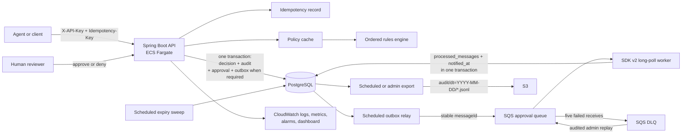

# AgentOps Gate

AgentOps Gate evaluates proposed AI tool calls against an ordered policy. It returns `ALLOW`, `DENY`, or `REQUIRE_APPROVAL`; it does not execute the tool call. Approval-required decisions create durable human-review work, and every state change is recorded in an append-only audit stream.

## Status

As of 2026-08-29:

- Local: `docker compose up` runs the full flow; **75 tests** pass with Docker (Testcontainers PostgreSQL
  and LocalStack), plus the deterministic simulation (2,000 seeds) and four jqwik properties.
- AWS: deployed by hand with `cdk deploy` into a personal account, exercised end to end, load-tested at
  two task sizes, chaos-tested, then destroyed. Every number in this README comes from those runs and
  is recorded under [docs/evidence/](docs/evidence/). The account currently holds no running resources.
- CI/CD: the GitHub Actions workflows and the OIDC deploy role are defined and synthesize, but have
  **not been exercised** — the repository is not public yet. Until it is, "deployed by hand" is the
  accurate description.

## Problem

An agent can propose a tool call faster than a human can review one. The service needs to answer low-risk calls immediately, deny disallowed calls, and turn higher-risk calls into durable approvals without losing work across database, queue, process, or network failures.

The domain stays small: versioned policies contain ordered rules; a rule can match a tool-name glob, argument regex, agent ID, and risk tier. The first complete match wins and no match means `DENY`. Decisions are immutable. Approvals move from `PENDING` to `APPROVED`, `DENIED`, or `EXPIRED`.

## Architecture



The HTTP API, outbox relay, SQS worker, expiry sweep, and export scheduler run in one image. Compose runs that image with PostgreSQL and LocalStack; Fargate runs it with RDS, SQS, and S3. The rules engine is plain Java. The policy cache is keyed by policy ID and rule-set version and is invalidated when a rule is added.

### Why each service

| Service | Why | Interview line |
|---|---|---|
| Spring Boot 4, Java 21 | Web, Data JPA, Validation, and Actuator in one service | “The API and background work use the same transaction and configuration model.” |
| RDS PostgreSQL + Flyway | Rules, decisions, approvals, idempotency records, outbox rows, and audit records are relational | “Schema changes are versioned and replayable.” |
| SQS + DLQ | Approval work is asynchronous and must survive worker failure | “The API does not wait for a human.” |
| S3 export | Audit consumers can read date-partitioned JSONL without querying the production database | “Batch export separates audit reads from request traffic.” |
| IAM task role | SDK access is scoped to the approval queues, audit prefix, metrics namespace, and API-key secret | “The container has no static AWS key.” |
| Secrets Manager | Database credentials and the API key are injected at runtime | “Secrets are absent from the image and repository.” |
| ECS Fargate | The long-poll worker and schedulers need a resident process | “The same image runs in Compose and Fargate.” |
| CloudWatch | Stores logs and application/ECS metrics; alarms on 5xx responses and DLQ depth | “The runbook starts from an alarm and names the recovery command.” |
| CDK (TypeScript) | Defines seven independently deployable stacks | “The infrastructure can be synthesized before deployment.” |
| GitHub Actions + OIDC | Builds, tests, pushes to ECR, and deploys from `main` without static keys | “Trust is scoped to one repository and branch.” |
| AWS SDK v2 directly | Spring Cloud AWS 3.4 fails under Boot 4.1 at runtime | “Explicit clients avoid a known binary incompatibility.” |

The design decisions are recorded in [docs/adr](docs/adr/).

## Correctness

The deterministic simulation drives the real `DecisionService`, `ApprovalService`, `OutboxRelay`, `ApprovalQueueWorker`, and expiry logic through in-memory repository ports, a seeded virtual clock, and a fault-injecting event bus. It checks these invariants after every step:

1. Every `REQUIRE_APPROVAL` decision has exactly one approval.
2. Every approval reaches `APPROVED`, `DENIED`, or `EXPIRED` after the simulation quiesces.
3. Replaying an idempotent decision request never creates a second decision.
4. The audit log remains append-only and totally ordered per aggregate.
5. Every outbox row is eventually sent and produces one effect even when its message is published twice.

A fresh 2,000-seed run completed 251,759 steps and created 6,000 decisions. It finished with 2,000 approvals in each terminal state. The bus injected 2,207 duplicates, 2,087 reorders, 2,086 delays, 1,679 drop-then-redeliver events, 970 crashes before commit, and 1,010 crashes after commit; 2,207 duplicate deliveries reached the worker. The simulator reported 1,940 ms of simulation time and persisted the same totals to `target/sim-coverage.json`. `-Dsim.seed=<n>` reproduces a failure with its event trace.

The rules engine also has four jqwik properties with 1,000 trials each: generated policies agree with an independent reference evaluator, unmatched calls default to deny, a lower-priority rule cannot change an existing match, and glob matching agrees with a separate regex translation. Surefire writes `TEST-dev.affan.agentopsgate.rules.RulesEngineProperties.xml`, so these properties run in the default suite.

The Docker-backed suite passes 75/75 tests. Its Testcontainers coverage uses PostgreSQL for migrations, transactions, API idempotency, and persistence, and LocalStack for SQS publishing, outbox retry, duplicate delivery, DLQ replay, approval expiry, S3 export, and JSONL read-back.

## Exactly-once plumbing

SQS delivery and outbox publishing are at least once. The application makes their effects idempotent at each boundary:

| Mechanism | Protects against | Result |
|---|---|---|
| `Idempotency-Key` on `POST /decisions` | Client timeout and request retry | The same key and canonical body return the stored decision; the same key with a different body returns 409. |
| Decision transaction | Partial database state | Decision, audit, pending approval, and outbox row commit together when approval is required. |
| Transactional outbox | Decision commit followed by failed SQS publish | The durable row stays pending until a relay send succeeds. |
| Stable outbox UUID in the message | SQS transport IDs changing during replay | The logical work keeps one identity across retries and DLQ replay. |
| `processed_messages` transaction | Duplicate SQS delivery or relay retry | The message claim and approval notification effect commit together; duplicates are deleted without a second effect. |
| DLQ and audited replay endpoint | Poison messages and repeated worker failure | SQS isolates a message after five receives; an operator fixes the cause and moves up to ten messages back through the API. |

The relay claims batches of 50 with `FOR UPDATE SKIP LOCKED`. It records `sent_at` after a successful send and retains attempt/error data after failure. The worker long-polls for up to 20 seconds and deletes a receipt only after processing succeeds. An undecodable message logs `event=approval_queue_message_invalid` with its SQS message ID, increments `gate.worker.invalid`, and remains on the queue for redrive. In AWS, five receives with a 60-second visibility timeout move it to the DLQ after about five minutes; replay returns it to the main queue for another five attempts. The independent expiry sweep prevents a delayed or unavailable queue from keeping an approval pending forever.

## Performance

The baseline was measured on 2026-08-29 against one Fargate task with 0.25 vCPU and 0.5 GB, using `load/decisions.js` for an 80-second 5-to-50 requests/second ramp.

| Measurement | Baseline |
|---|---:|
| Errors | 0 |
| Sustained throughput | about 21 requests/second |
| Median latency | 3.1 seconds |
| p99 latency | 6.8 seconds |
| ECS CPU utilization | 100% throughout |
| RDS CPU utilization | 5% |
| Database connections | 10 |

The baseline indicates that the task was CPU-bound while RDS was idle. The tuned image uses Serial GC, first-tier compilation, class-data sharing, and a 75% heap limit; Hikari is capped at five connections with one idle connection; the policy cache removes policy/rule reads after warm-up; and the performance profile avoids per-request INFO logging.

| Measurement | Baseline 0.25 vCPU | Tuned 0.25 vCPU | Tuned 0.5 vCPU / 1 GB |
|---|---:|---:|---:|
| Errors | 0 / 1,736 | 0 / 2,774 | 0 / 2,796 |
| Sustained throughput | 21 rps | 34.5 rps | 34.9 rps (profile maximum) |
| Median latency | 3.13 s | 173 ms | 32 ms |
| p90 / p95 | 4.92 s / 5.38 s | 409 ms / 567 ms | 106 ms / 120 ms |
| p99 | 6.79 s | 1.09 s | 285 ms |
| ECS CPU (per-minute avg/max) | 100% | 100% at peak | 47% / 49% |
| ECS memory | — | ≈ 60% of 0.5 GB | 29% of 1 GB |
| Extra cost | — | $0 | +$9.01 / month always-on |

Same database, same load script, same workstation. The quarter-core task is at capacity under this
profile (its p99 is queueing); the half-core has headroom. Full numbers and the reading are in
[docs/evidence/perf.md](docs/evidence/perf.md). Chaos capture: see
[docs/evidence/chaos.md](docs/evidence/chaos.md).

Run the same load profile with:

```bash
BASE_URL='http://<task-public-ip>:8080' API_KEY='<api-key>' POLICY_ID='<policy-id>' \
  k6 run load/decisions.js
```

The CDK comparison changes only task size:

```bash
cd infra
npx cdk deploy AgentOpsServiceStack --require-approval never \
  -c imageTag='<image-tag>' -c taskCpu=512 -c taskMemory=1024
```

## Operations

CloudWatch export is enabled only when both `agentops.aws.enabled=true` and `agentops.metrics.cloudwatch.enabled=true`; local and test profiles disable it. The `AgentOpsGate` namespace contains decision counts by effect, outbox backlog/sent/failed, worker processed/duplicate/invalid counts, HTTP response classes, and `http.server.requests` latency histograms.

The CDK service stack creates:

- an alarm for at least five HTTP 5xx responses in five minutes;
- an alarm when the approval DLQ has at least one visible message;
- a dashboard for p99 latency, request rate, 5xx count, outbox backlog, DLQ depth, and ECS CPU/memory.

Recovery steps and the audited replay command are in the [operations runbook](docs/runbook.md).

## Cost (us-east-1, on-demand, AWS Pricing API 2026-08-29)

| Resource | Unit price | Always-on / month (730 h) | Per day while deployed |
|---|---:|---:|---:|
| ECS Fargate task, 0.25 vCPU + 0.5 GB (Linux/x86) | $0.040478/vCPU-h + $0.004446/GB-h = $0.01234/h | $9.01 | $0.30 |
| RDS db.t4g.micro, PostgreSQL, Single-AZ | $0.016/h | $11.68 | $0.38 |
| RDS storage, 20 GB gp3 | $0.115/GB-mo | $2.30 | $0.08 |
| Secrets Manager, 2 secrets | $0.40/secret-mo | $0.80 | $0.03 |
| SQS, S3, CloudWatch, ECR at demo volumes | metered, ~free-tier scale | ≈ $0.50 | ≈ $0.02 |
| **Total** | | **≈ $24.3** | **≈ $0.80** |

The $10/month ceiling therefore holds only under the project's operating rule:
deploy for capture and demos, `cdk destroy --all` between (≈ 12 deployed
days/month before the Budgets alarm fires). A NAT gateway alone would add
$32/month, an ALB $16/month — both deliberately absent.

## Deployment

The CDK app defines seven stacks: GitHub OIDC, Network, Data, Queue, Bucket, Service, and Budget. The OIDC stack is independent; the service stack consumes the other application resources.

The VPC has two Availability Zones, public subnets only, and no NAT gateway. Fargate tasks receive public IPs to reach ECR, Secrets Manager, SQS, and S3 directly. RDS is also placed in those public subnets, but `publiclyAccessible` is false and its security group accepts port 5432 only from the task security group. Network access is controlled by that security group, and the database has no public endpoint; subnet placement is not what keeps it private.

The first AWS deploy was run by hand from a workstation, as recorded in [the smoke evidence](docs/evidence/2026-08-29-aws-smoke.md). The GitHub Actions workflow has not been exercised; it remains pending until the repository is public.

Synthesize and deploy with an existing ECR image tag:

```bash
cd infra
npx tsc --noEmit
npx cdk synth
npx cdk deploy --all --require-approval never \
  -c imageTag='<existing-ecr-image-tag>' \
  -c budgetEmail='alerts@example.test' \
  -c taskCpu=256 -c taskMemory=512
```

### One-time GitHub OIDC bootstrap

Bootstrap CDK, deploy the independent OIDC stack, and copy its role output into the repository variable:

```bash
export AWS_ACCOUNT_ID="$(aws sts get-caller-identity --query Account --output text)"
cd infra
npx cdk bootstrap "aws://$AWS_ACCOUNT_ID/us-east-1"
npx cdk deploy AgentOpsGithubOidcStack --require-approval never
export AWS_ROLE_ARN="$(aws cloudformation describe-stacks --stack-name AgentOpsGithubOidcStack --query \"Stacks[0].Outputs[?OutputKey=='GithubDeployRoleArn'].OutputValue\" --output text)"
cd ..
gh variable set AWS_ROLE_ARN --body "$AWS_ROLE_ARN"
```

If the account already has GitHub's provider, add `-c oidcProviderArn="arn:aws:iam::$AWS_ACCOUNT_ID:oidc-provider/token.actions.githubusercontent.com"` to the deploy command. OIDC provides short-lived credentials with trust scoped to `repo:Aly700/agentops-gate` on `main`; there are no static AWS keys to rotate or expose.

## API

All API routes except `/actuator/health` require `X-API-Key`. `POST /decisions` also requires a non-blank `Idempotency-Key`; replaying the same canonical JSON body returns the stored response with 200, while reusing the key for a different body returns 409.

| Method | Path | Purpose |
|---|---|---|
| `POST` | `/policies` | Create a versioned policy |
| `POST` | `/policies/{id}/rules` | Append a rule at a precedence |
| `POST` | `/decisions` | Evaluate and persist a proposed call; requires `Idempotency-Key` |
| `GET` | `/decisions/{id}` | Read an immutable decision |
| `GET` | `/approvals/{id}` | Read an approval |
| `GET` | `/approvals?status=&limit=&cursor=` | List approvals by status, newest first; default limit 50, maximum 100 |
| `POST` | `/approvals/{id}/approve` | Approve a pending approval |
| `POST` | `/approvals/{id}/deny` | Deny a pending approval |
| `GET` | `/audit?from=&to=` | Query the append-only audit stream |
| `POST` | `/admin/exports/audit?date=` | Export one UTC day to S3 immediately |
| `POST` | `/admin/dlq/replay?limit=` | Move up to ten DLQ messages back to the approval queue |
| `GET` | `/actuator/health` | Container health endpoint |

Invalid input returns RFC 9457 `application/problem+json`. Missing or incorrect API keys return 401; missing resources return 404; duplicate resources and invalid approval transitions return 409.

## Run locally

Prerequisites are Docker with Compose and three local-only environment variables. Secrets are not stored in this repository.

```bash
export POSTGRES_USER=agentops
export POSTGRES_PASSWORD='choose-a-local-password'
export AGENTOPS_API_KEY='choose-a-local-api-key'
docker compose up --build -d --wait
curl --fail http://localhost:8080/actuator/health
```

LocalStack initializes `agentops-gate-approvals`, its DLQ, and `agentops-gate-audit` in `us-east-1`. The `local` Spring profile uses its endpoint with dummy LocalStack credentials and path-style S3 access.

### Compose walkthrough

Create a policy and copy its `id` into `POLICY_ID`:

```bash
curl --fail-with-body -X POST http://localhost:8080/policies \
  -H "X-API-Key: $AGENTOPS_API_KEY" \
  -H 'Content-Type: application/json' \
  -d '{"name":"demo-policy","version":1}'

export POLICY_ID='paste-policy-id'
```

Add an explicit deny, an approval rule, and a final allow rule. Lower precedence numbers run first:

```bash
curl --fail-with-body -X POST "http://localhost:8080/policies/$POLICY_ID/rules" \
  -H "X-API-Key: $AGENTOPS_API_KEY" \
  -H 'Content-Type: application/json' \
  -d '{"toolNameGlob":"shell.*","effect":"DENY","precedence":10}'

curl --fail-with-body -X POST "http://localhost:8080/policies/$POLICY_ID/rules" \
  -H "X-API-Key: $AGENTOPS_API_KEY" \
  -H 'Content-Type: application/json' \
  -d '{"toolNameGlob":"fs.*","riskTier":"HIGH","effect":"REQUIRE_APPROVAL","precedence":20}'

curl --fail-with-body -X POST "http://localhost:8080/policies/$POLICY_ID/rules" \
  -H "X-API-Key: $AGENTOPS_API_KEY" \
  -H 'Content-Type: application/json' \
  -d '{"toolNameGlob":"*","effect":"ALLOW","precedence":30}'
```

Evaluate one call for each outcome. The first response is `ALLOW`, the second is `DENY`, and the third is `REQUIRE_APPROVAL`:

```bash
export ALLOW_IDEMPOTENCY_KEY="allow-$(date +%s)"
curl --fail-with-body -X POST http://localhost:8080/decisions \
  -H "X-API-Key: $AGENTOPS_API_KEY" \
  -H "Idempotency-Key: $ALLOW_IDEMPOTENCY_KEY" \
  -H 'Content-Type: application/json' \
  -d "{\"policyId\":\"$POLICY_ID\",\"agentId\":\"demo-agent\",\"toolName\":\"browser.read\",\"arguments\":{\"url\":\"https://example.test\"},\"riskTier\":\"LOW\"}"

# Same key and canonical body: HTTP 200 with the identical stored decision.
curl --fail-with-body -X POST http://localhost:8080/decisions \
  -H "X-API-Key: $AGENTOPS_API_KEY" \
  -H "Idempotency-Key: $ALLOW_IDEMPOTENCY_KEY" \
  -H 'Content-Type: application/json' \
  -d "{\"policyId\":\"$POLICY_ID\",\"agentId\":\"demo-agent\",\"toolName\":\"browser.read\",\"arguments\":{\"url\":\"https://example.test\"},\"riskTier\":\"LOW\"}"

curl --fail-with-body -X POST http://localhost:8080/decisions \
  -H "X-API-Key: $AGENTOPS_API_KEY" \
  -H "Idempotency-Key: deny-$(date +%s)" \
  -H 'Content-Type: application/json' \
  -d "{\"policyId\":\"$POLICY_ID\",\"agentId\":\"demo-agent\",\"toolName\":\"shell.exec\",\"arguments\":{\"command\":\"false\"},\"riskTier\":\"CRITICAL\"}"

curl --fail-with-body -X POST http://localhost:8080/decisions \
  -H "X-API-Key: $AGENTOPS_API_KEY" \
  -H "Idempotency-Key: approval-$(date +%s)" \
  -H 'Content-Type: application/json' \
  -d "{\"policyId\":\"$POLICY_ID\",\"agentId\":\"demo-agent\",\"toolName\":\"fs.write\",\"arguments\":{\"path\":\"/sandbox/report.txt\"},\"riskTier\":\"HIGH\"}"

export APPROVAL_ID='paste-approval-id'
```

Approve the pending call, inspect the audit trail, export the current UTC day, list the object, and exercise the admin replay endpoint:

```bash
curl --fail-with-body -X POST "http://localhost:8080/approvals/$APPROVAL_ID/approve" \
  -H "X-API-Key: $AGENTOPS_API_KEY" \
  -H 'Content-Type: application/json' \
  -d '{"decidedBy":"demo-reviewer"}'

curl --fail-with-body 'http://localhost:8080/audit?from=2026-01-01T00:00:00Z&to=2027-01-01T00:00:00Z' \
  -H "X-API-Key: $AGENTOPS_API_KEY"

export EXPORT_DATE="$(date -u +%F)"
curl --fail-with-body -X POST "http://localhost:8080/admin/exports/audit?date=$EXPORT_DATE" \
  -H "X-API-Key: $AGENTOPS_API_KEY"

AWS_ACCESS_KEY_ID=test AWS_SECRET_ACCESS_KEY=test AWS_DEFAULT_REGION=us-east-1 \
  aws --endpoint-url http://localhost:4566 s3 ls \
  "s3://agentops-gate-audit/audit/dt=$EXPORT_DATE/"

# With an empty DLQ this returns {"replayed":0}; repeated empty calls have no effect.
curl --fail-with-body -X POST 'http://localhost:8080/admin/dlq/replay?limit=10' \
  -H "X-API-Key: $AGENTOPS_API_KEY"
```

The LocalStack queue has a five-receive redrive policy. Worker failures leave messages undeleted; after five receives SQS moves the message to `agentops-gate-approvals-dlq` for inspection.

An export is idempotent at the object-key level: every run for a UTC day refreshes `audit/dt=YYYY-MM-DD/YYYYMMDDT000000Z.jsonl`. The production bucket's versioning retains earlier object versions.

## Configuration

| Environment variable | Required | Purpose |
|---|---:|---|
| `DB_URL` | yes | PostgreSQL JDBC URL |
| `DB_USERNAME` | yes | Database username |
| `DB_PASSWORD` | yes | Database password |
| `AGENTOPS_API_KEY` | yes | Static API credential |
| `AGENTOPS_AWS_ENABLED` | production | Enables AWS transport adapters |
| `AGENTOPS_CLOUDWATCH_METRICS_ENABLED` | production | Enables the `AgentOpsGate` CloudWatch registry; requires AWS transport |
| `AWS_REGION` | production | Region for the explicit SDK clients |
| `APPROVAL_QUEUE_URL` | production/local | Exact SQS queue URL |
| `APPROVAL_DLQ_URL` | production/local | Exact approval DLQ URL used by admin replay |
| `AUDIT_BUCKET` | production/local | Exact audit bucket name |
| `AWS_ENDPOINT_URL` | local only | LocalStack endpoint override |
| `APPROVAL_TTL` | no | Pending lifetime; default `PT30M` |
| `APPROVAL_EXPIRY_INTERVAL` | no | Stale-approval sweep interval; default `PT1M` |
| `APPROVAL_WORKER_ENABLED` | no | Enables the scheduled SQS consumer; default `true` |
| `SQS_WAIT_TIME_SECONDS` | no | SQS receive long-poll duration; default `20` |
| `SQS_POLL_INTERVAL` | no | Delay between completed polls; default `PT1S` |
| `IDEMPOTENCY_TTL` | no | Decision-key retention; default `PT24H` |
| `OUTBOX_RELAY_INTERVAL` | no | Delay between outbox batches; default `PT1S` |
| `AUDIT_EXPORT_ENABLED` | no | Enables nightly export |

Production database credentials and the independently generated API key are injected from separate Secrets Manager values. AWS clients use `AWS_REGION` and the task-role credential chain; static AWS credentials are only used by the `local` profile.

## Tests

Pure tests, the 2,000-seed simulation, and compilation work without Docker:

```bash
./mvnw -o -q -Dtest='RulesEngineTest,ApprovalStateMachineTest,*CodecTest,*FilterTest,AuditExportServiceTest,PolicyCacheTest,CloudWatchMetricsConfigurationTest,OutboxMetricsTest' \
  -Dsurefire.failIfNoSpecifiedTests=false test
./mvnw -o -q -Dtest=RulesEngineProperties -Dsurefire.failIfNoSpecifiedTests=false test
./mvnw -o -q -Dtest=SimulationTest -Dsim.seeds=2000 \
  -Dsurefire.failIfNoSpecifiedTests=false test
./mvnw -o -q -DskipTests package
```

The default Maven discovery includes JUnit `*Test` and jqwik `*Properties` classes. `SimulationTest` uses 200 seeds by default; set `-Dsim.seed=<n>` to reproduce one seed.

Run the complete 70-test suite, including PostgreSQL and LocalStack Testcontainers, on a Docker host:

```bash
./mvnw -o -q test
```

## Demo and data safety

- The service evaluates proposals but cannot execute filesystem, browser, email, payment, deployment, or other external tools.
- Local mode is limited to the Compose PostgreSQL and LocalStack containers. Production AWS access is scoped to its database, queues, bucket, metrics namespace, and secrets.
- API keys and database passwords are supplied at runtime and are not returned or logged.
- Proposed arguments are persisted with the immutable decision; structured request logs do not read or copy request bodies.
- Denials, approval expiry, invalid transitions, queue disablement, and export unavailability are explicit states or errors.

## What was deliberately left out

- Kubernetes
- Kafka
- OAuth
- A frontend
- Multi-region deployment
- An Application Load Balancer
- NAT gateways

These additions would increase cost or operational surface without changing the policy-and-approval requirements in scope.
