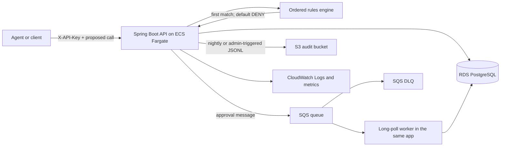

# AgentOps Gate

AgentOps Gate is a small policy and approval service for AI tool calls. An agent proposes a call; the service evaluates an ordered policy and returns `ALLOW`, `DENY`, or `REQUIRE_APPROVAL`. It never executes the proposed tool itself.

Approval-required decisions create a pending approval and an SQS message. Decisions and audit records are immutable, approval transitions are constrained, and audit records can be exported as date-partitioned JSON Lines objects in S3.

> **Checkout status:** The policy, persistence, web, expiry, export-format, local-runtime, workflow, and CDK layers are present and compile offline. The concrete AWS SDK v2 SQS/S3 adapters and LocalStack module tests still require three artifacts that are not present in the supplied offline Maven cache: `spring-cloud-aws-starter-sqs:3.4.0`, `spring-cloud-aws-starter-s3:3.4.0`, and `org.testcontainers:localstack:2.0.5`. Until those are warmed and the adapters are added, the `local` profile intentionally fails closed instead of pretending that queue/export operations succeeded. The Compose walkthrough below describes the completed LocalStack path after that dependency gate is cleared.

## Architecture



The rules engine is a plain Java class. It sorts rules by ascending precedence, stops at the first complete match, and defaults to `DENY`. Matchers are optional except for the tool-name glob; supported dimensions are tool glob (`fs.*` and `*`), argument regex, exact agent ID, and risk tier.

The application uses an AWS SDK v2 `SqsClient` long-poll worker instead of `@SqsListener`. Receipt deletion and retry behavior remain explicit, and the service does not rely on Spring Cloud AWS 3.4 listener-container compatibility with Spring Boot 4.1/Spring Framework 7. The rejected listener alternative is shorter, but it is a less predictable runtime boundary on this version combination.

## API

All API routes except `/actuator/health` require `X-API-Key`.

| Method | Path | Purpose |
|---|---|---|
| `POST` | `/policies` | Create a versioned policy |
| `POST` | `/policies/{id}/rules` | Append a rule at a precedence |
| `POST` | `/decisions` | Evaluate and persist a proposed call |
| `GET` | `/decisions/{id}` | Read an immutable decision |
| `POST` | `/approvals/{id}/approve` | Approve a pending approval |
| `POST` | `/approvals/{id}/deny` | Deny a pending approval |
| `GET` | `/audit?from=&to=` | Query the append-only audit stream |
| `POST` | `/admin/exports/audit?date=` | Export one UTC day to S3 immediately |
| `GET` | `/actuator/health` | Container health endpoint |

Invalid input returns RFC 9457 `application/problem+json`. Missing or incorrect API keys return 401; missing resources return 404; duplicate resources and invalid approval transitions return 409.

## Run locally

Prerequisites are Docker with Compose and three local-only environment variables. Secrets are intentionally not stored in this repository.

```bash
export POSTGRES_USER=agentops
export POSTGRES_PASSWORD='choose-a-local-password'
export AGENTOPS_API_KEY='choose-a-local-api-key'
docker compose up --build -d
curl --fail http://localhost:8080/actuator/health
```

LocalStack initializes `agentops-gate-approvals`, its DLQ, and `agentops-gate-audit` in `us-east-1`. The `local` Spring profile uses its endpoint with dummy LocalStack credentials and path-style S3 access.

### Curl walkthrough

Create a policy and copy the returned `id` into `POLICY_ID`:

```bash
curl --fail-with-body -X POST http://localhost:8080/policies \
  -H "X-API-Key: $AGENTOPS_API_KEY" \
  -H 'Content-Type: application/json' \
  -d '{"name":"demo-policy","version":1}'

export POLICY_ID='paste-policy-id'
```

Require approval for filesystem calls, then allow the remaining calls:

```bash
curl --fail-with-body -X POST "http://localhost:8080/policies/$POLICY_ID/rules" \
  -H "X-API-Key: $AGENTOPS_API_KEY" \
  -H 'Content-Type: application/json' \
  -d '{"toolNameGlob":"fs.*","riskTier":"HIGH","effect":"REQUIRE_APPROVAL","precedence":10}'

curl --fail-with-body -X POST "http://localhost:8080/policies/$POLICY_ID/rules" \
  -H "X-API-Key: $AGENTOPS_API_KEY" \
  -H 'Content-Type: application/json' \
  -d '{"toolNameGlob":"*","effect":"ALLOW","precedence":20}'
```

Evaluate a proposed call and copy the returned `id` and `approvalId`:

```bash
curl --fail-with-body -X POST http://localhost:8080/decisions \
  -H "X-API-Key: $AGENTOPS_API_KEY" \
  -H 'Content-Type: application/json' \
  -d "{\"policyId\":\"$POLICY_ID\",\"agentId\":\"demo-agent\",\"toolName\":\"fs.write\",\"arguments\":{\"path\":\"/sandbox/report.txt\"},\"riskTier\":\"HIGH\"}"

export DECISION_ID='paste-decision-id'
export APPROVAL_ID='paste-approval-id'
```

Read and approve it, query the audit stream, and trigger an export:

```bash
curl --fail-with-body "http://localhost:8080/decisions/$DECISION_ID" \
  -H "X-API-Key: $AGENTOPS_API_KEY"

curl --fail-with-body -X POST "http://localhost:8080/approvals/$APPROVAL_ID/approve" \
  -H "X-API-Key: $AGENTOPS_API_KEY" \
  -H 'Content-Type: application/json' \
  -d '{"decidedBy":"demo-reviewer"}'

curl --fail-with-body 'http://localhost:8080/audit?from=2026-01-01T00:00:00Z&to=2027-01-01T00:00:00Z' \
  -H "X-API-Key: $AGENTOPS_API_KEY"

curl --fail-with-body -X POST 'http://localhost:8080/admin/exports/audit?date=2026-08-28' \
  -H "X-API-Key: $AGENTOPS_API_KEY"

docker compose exec localstack awslocal s3 cp \
  s3://agentops-gate-audit/audit/year=2026/month=08/day=28/audit.jsonl -
```

Use a current UTC date in the audit and export commands when running the walkthrough.

## Configuration

| Environment variable | Required | Purpose |
|---|---:|---|
| `DB_URL` | yes | PostgreSQL JDBC URL |
| `DB_USERNAME` | yes | Database username |
| `DB_PASSWORD` | yes | Database password |
| `AGENTOPS_API_KEY` | yes | Static API credential |
| `AGENTOPS_AWS_ENABLED` | production | Enables AWS transport adapters |
| `APPROVAL_QUEUE_URL` | production/local | Exact SQS queue URL |
| `AUDIT_BUCKET` | production/local | Exact audit bucket name |
| `AWS_ENDPOINT_URL` | local only | LocalStack endpoint override |
| `APPROVAL_TTL` | no | Pending lifetime; default `PT30M` |
| `AUDIT_EXPORT_ENABLED` | no | Enables nightly export |

Production database credentials and the independently generated API key are injected from separate Secrets Manager values by the ECS task definition. AWS clients use the task role and the default region provider; static AWS credentials are only used by the `local` profile.

## Why each service

<!-- LEAD INTERVIEW TABLE PLACEHOLDER: replace the provisional table below with the exact interview table. -->

| Service | Why it is here |
|---|---|
| ECS Fargate | Runs one conventional Spring service without managing instances or a Kubernetes control plane. |
| RDS PostgreSQL | Provides transactions, constraints, JSONB, indexes, and database-level immutability triggers. |
| SQS + DLQ | Decouples approval work and makes retries and poison messages visible. |
| S3 | Stores inexpensive, date-partitioned immutable-style JSONL audit exports. |
| Secrets Manager | Keeps runtime database credentials out of images, task definitions, and source. |
| CloudWatch | Receives structured ECS logs and alarms on repeated HTTP 5xx responses. |
| AWS Budgets | Sends an early warning when monthly spend reaches the configured $10 budget. |
| ECR | Stores the immutable application image used by the Fargate task definition. |

<!-- END LEAD INTERVIEW TABLE PLACEHOLDER -->

## Infrastructure and deployment

The CDK app contains separate Network, Data, Queue, Bucket, Service, and Budget stacks. It intentionally creates only public subnets and no NAT gateway. The Fargate task receives a public IP; PostgreSQL remains non-public and accepts port 5432 only from the task security group. The API security group opens port 8080 because an ALB is deliberately out of scope.

```bash
cd infra
npm ci
npx tsc --noEmit
npx cdk synth
npx cdk deploy --all --require-approval never \
  -c imageTag='<existing-ecr-image-tag>' \
  -c budgetEmail='alerts@example.test'
```

The deploy workflow uses GitHub OIDC and `vars.AWS_ROLE_ARN`; it contains no static AWS keys. It creates the named ECR repository if absent, pushes the commit-SHA image, and passes that tag to CDK.

## Tests

Pure tests and compilation work without Docker:

```bash
./mvnw -o -q -Dtest='RulesEngineTest,ApprovalStateMachineTest,ApiKeyFilterTest,AuditExportServiceTest,ApprovalMessageCodecTest,HttpRequestLoggingFilterTest' \
  -Dsurefire.failIfNoSpecifiedTests=false test
./mvnw -o -q -DskipTests package
```

Run the complete suite, including PostgreSQL and LocalStack Testcontainers, on a Docker host:

```bash
./mvnw -q verify
```

## Cost posture

This is a low-volume interview/demo architecture, not a free architecture. The single-AZ `db.t4g.micro` database and always-on Fargate task are the main steady costs; SQS, S3, ECR, Secrets Manager, logs, and public IPv4 also incur usage charges. The $10 AWS Budget is an alert, not a spending cap. Destroy disposable stacks promptly, while noting that the database, secret, and bucket use retain policies to prevent accidental data loss.

## Demo and data safety

- The service evaluates proposals but has no capability to execute filesystem, browser, email, payment, deployment, or other external tools.
- Local mode is sandboxed to the Compose PostgreSQL and LocalStack containers. Production mode is write-capable only for its scoped database, one queue, one bucket, and one secret.
- API keys and database passwords are supplied at runtime and are never returned or logged.
- Proposed arguments are persisted with the immutable decision; logs and audit detail records avoid copying them.
- Denials, approval expiry, invalid transitions, queue disablement, and export unavailability are explicit states or errors rather than simulated success.

## Deliberately left out

- Kubernetes
- Kafka
- OAuth
- A frontend
- Multi-region deployment
- An Application Load Balancer
- NAT gateways

Those additions would increase cost and operational surface without improving this service’s deliberately small policy-and-approval domain.
